# Mythras - AngryGorilla's Custom Macros

A Foundry Virtual Tabletop module that turns many common Mythras combat and campaign procedures into guided dialogs, interactive chat cards, and token indicators.

The module is designed for the Foundry VTT **Mythras** system and supports play using the **Mythras Rulebook** and expanded options commonly used from the **Mythras Companion**. It does not replace either book: the books remain the authority for when an action, Special Effect, modifier, or optional rule is appropriate.

# Highlights

- Staged Attack cards with hit-location, damage, armour, Parry, Evade, and opposed-roll support.
- A Special Effects selector filtered by weapon types, combat effects, criticals, and fumbles.
- Automation for Impale, Entangle, Sunder, Stun Location, Bleed, Disable Attack (Press Advantage, Pin Down, Overextend Opponent), Pin Weapon, Take Cover, and Damage Weapon.
- Persistent melee engagement range, equipped weapons, reload ranged weapons, ward locations, take cover, and movement state tracking.
- Compact token icons with rich tooltips for wounds, fatigue, armour, weapons, cover, engagement, impalement, entanglement, stun, bleeding, and disabled attacks.
- Utilities for Action Points, Luck Points, skill improvement, currency, armour, NPC generation, and combat cleanup.
- Tooltips for Character Status and Equipped Items.
- Optional item statistics and other campaign tools.

# Requirements And Compatibility

- **Foundry VTT:** Version 13.
- **Game system:** [Mythras](https://gitlab.com/kp-systems/mythras) for Foundry VTT
- **Rules:** A legal copy of the Mythras Rulebook is expected. The Mythras Companion is recommended when using expanded combat material from that book.

The module automates procedures and records state, but it does not decide whether a rule is valid for your campaign. The Games Master should resolve any difference between automation and the table's chosen printing, supplements, or house rules.

The imported macros are lightweight launchers. Their gameplay logic remains in the module, so future module updates can improve behavior without requiring the macros to be copied into the world again. New macros would need to be imported once, however.

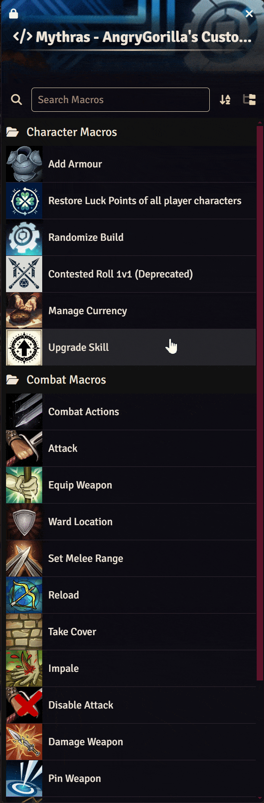

# Quick Start

1. Select the token that will act.
2. Target another token when the action needs a defender or recipient.
3. Run the relevant macro.
4. Complete the dialog, then use the resulting chat-card controls.
5. At the end of a fight, run **Clean Up Combat Flags** to remove temporary statuses you no longer need.

Many character-changing actions require ownership of the actor. However, in many cases, a GM socket is utilized to allow players to inflict statuses on target characters. Multi-token and large scope utilities are best run by a GM, though.

# Module Settings

Open **Configure Settings > Module Settings > Mythras - AngryGorilla's Custom Macros**.

| Setting | Default | Purpose |
| --- | --- | --- |
| **Bleeding Fatigue Progression** | On | At the start of a new Combat Round, advances a bleeding combatant one step along the Mythras fatigue track and posts the change to chat. |
| **Movement State Control in Combat** | Off | Enables Walk, Run, Sprint, Climb, and Swim tracking, first-turn movement prompts, and the **Set Movement State** macro. |
| **Reach Mechanics** | On | Enables persistent melee engagement ranges, range-aware Attack and Parry behavior, the **Set Melee Range** macro, and melee engagement range indicators. |
| **Armour Overlay Icons** | On | Shows an armour indicator on tokens with equipped armour. Its tooltip groups armour by hit location. |
| **Endurance Roll Prompts in Combat** | On | Tracks combat exertion and posts Endurance prompts at intervals determined by Constitution. |
| **AngryGorilla's Homebrew Rules and Content** | Off | Enables the homebrew **Re-roll Damage** Special Effect and unlocks the non-standard **Exemplary** quality tier when Quality Tracking is enabled. |
| **Fitting** | Off | Adds Fitting fields to item sheets: SIZ and Frame for armour, clothing, and trinkets, plus a Body Part field for armour. |
| **Quality Tracking** | Off | Adds a Quality field to armour, equipment, and weapon sheets. |
| **Original Condition** | Off | Adds original AP/HP fields to armour and weapon sheets so damaged/broken condition can be flagged as current AP/HP drops. Also adds original Value/Quality fields when Quality Tracking is enabled. |
| **Show Character Status and Equipped Items on Token Hover** | On | Allow all users to Ctrl+Hover on a token to see a two-tab tooltip. One tab shows a summary of the character status with icons representing individual hit locations' condition. The other tab lists all of their items that have the storage set to "Equipped". If the item is a storage item, it will only show up in this list if it is set to be Carried. This tab also provides several filters. |

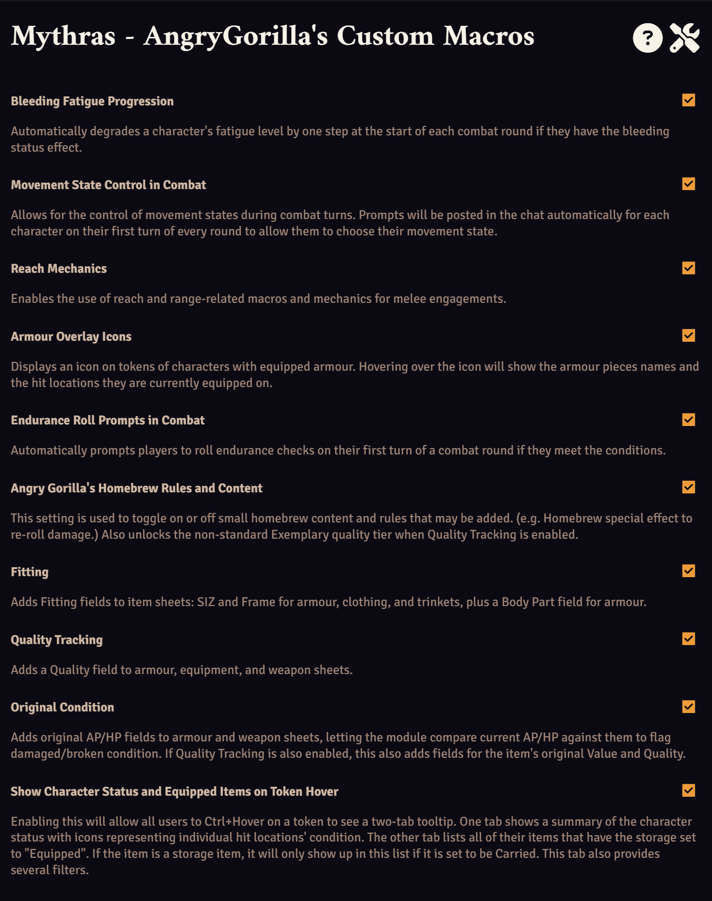

# Status Indicators And Tooltips on Tokens

Many features throughout this module communicate information to the user through small, semi-transparent icons on the token. Hovering over these status indicators will show detailed tooltips with relevant information regarding the individual statuses.

# Clean Up Combat Flags Macro

As many of the features within this module set persistent flags on characters and items to display specific combat-related statuses, this general, all-purpose macro exists to help clean up these flags after combat.

Run **Clean Up Combat Flags** after a battle or when testing stateful features. If tokens are selected, only the selected actors are processed; otherwise all world actors are cleaned up for the checked flags.

The dialog can independently clear melee engagements, movement states, wards, cover, held weapon assignments, reload progress, pinned or impaling weapons, impaled, entangled, stunned, or bleeding locations/characters, and Disable Attack effects. This is a broad maintenance operation and is best run by the GM.

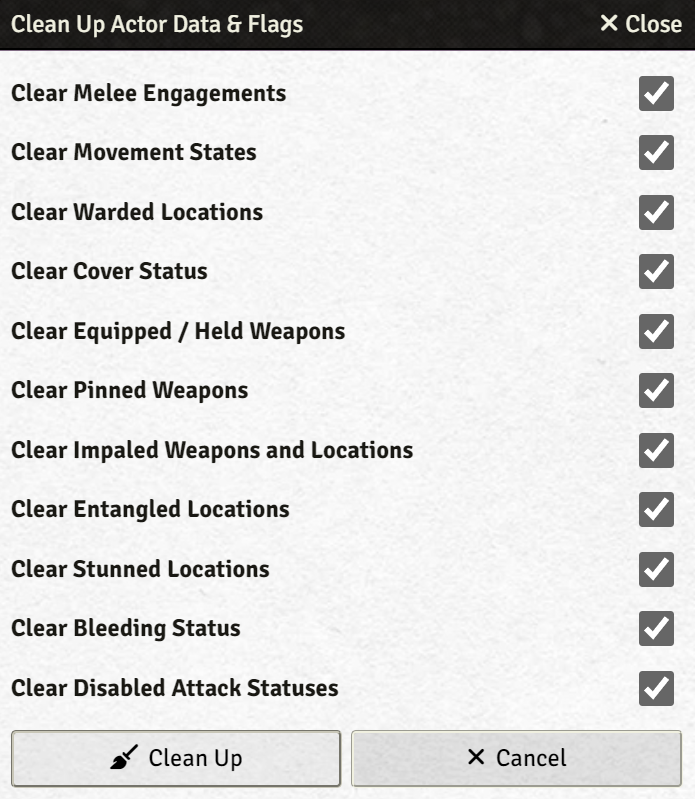

# Combat Workflow

## Combat Actions Reference

Run **Combat Actions** to browse proactive, reactive, and free actions. Filters narrow the list by melee, ranged, magic, movement, or general use. Selecting an action can post its description and movement restrictions to chat, with an option to spend an Action Point for non-free actions.

This is simply a reference for Rulebook actions; it does not replace the action's required rolls or the GM's ruling. Movement restrictions are only included as a reference in case the related rules from the *Mythras - Companion* book are being followed.

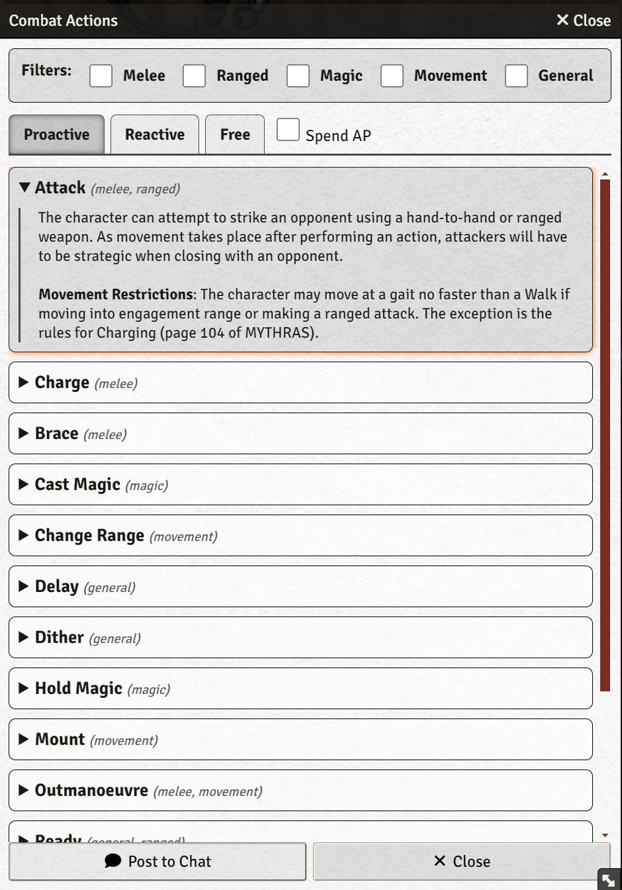

## Equip Weapon

Select an owned token and run the **Equip Weapon** macro. Assign each weapon to the hit location or locations holding it. A weapon can be held by multiple hit locations to reflect multi-handedness. Humanoid arms are shown first, while nonstandard locations remain available below. Holding locations drive weapon indicators and determine whether Entangle or Stun prevents use.

Weapons *must* be equipped to a functioning hit location in order to use them in combat.

Held weapons appear as icons overlayed on the token. Hover tooltips show weapon statistics and states such as damage, breakage, pinning, impalement, and reload progress.

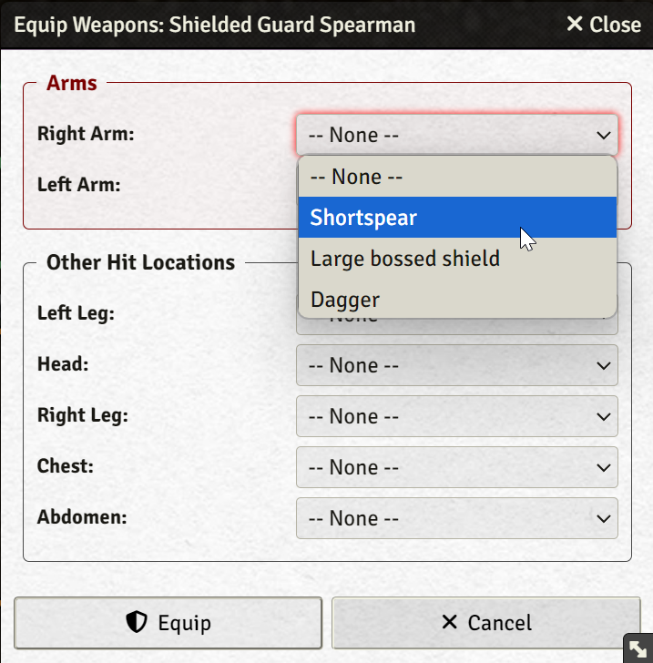

### Reload And Unload

Ranged weapons with a non-zero Load value are required to be loaded before they can be fired. Select a token with an equipped ranged weapon and run the **Reload** macro. Choose a held or equipped ranged weapon and enter how many Load actions are completed. Progress is stored until the weapon reaches its required Load value. The same dialog can unload it.

A ranged weapon that requires loading remains disabled in Attack until fully loaded. Firing resets its load progress.

## Attack

Select the attacker, target the defender, and run **Attack**. The dialog provides combat style, difficulty, weapon, augmentation, AP and Luck spending, charging, ammunition, and damage-modifier controls, plus an optional Force Roll Result to bypass the dice and set an exact d100 result. Forced rolls are clearly marked in the resulting message.

Broken, pinned, impaling, entangled, stunned, out-of-reach, and unloaded weapons are unable to attack (these are clearly indicated in the weapon selection dropdown). 

The Attack dialog presents several advanced options. At the very top, a Roll Modifiers hint is shown if there are any supported roll modifiers applicable. It can be hovered on to show the list of modifiers.

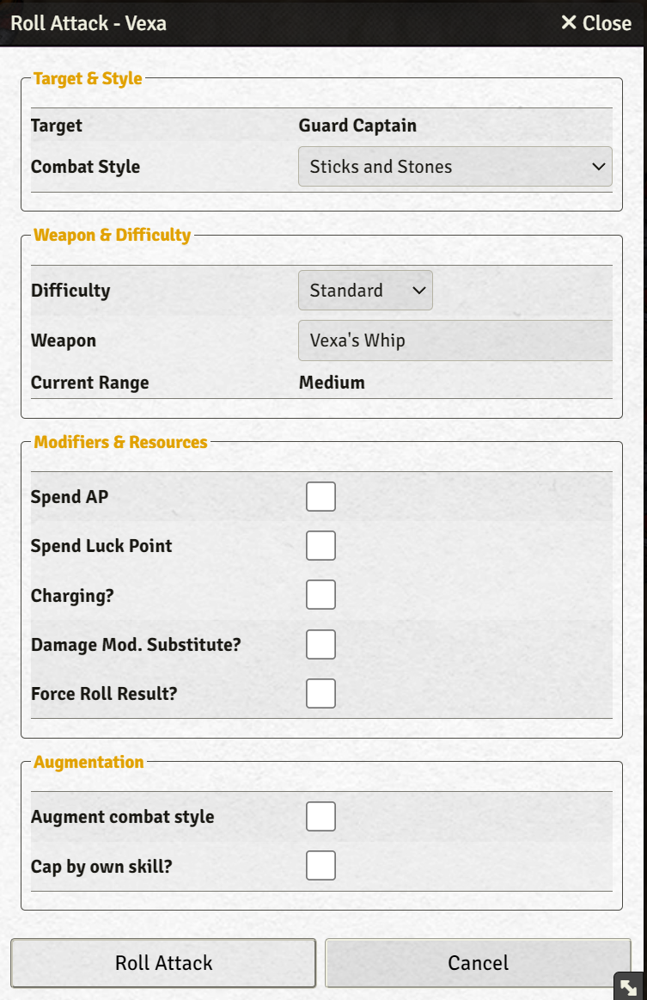

### Target and Style

#### Target
This indicates the intended target of the attack. Currently, the Attack macro only allows attacking individual opponents, however, multiple tokens can be targeted to select between them from a dropdown. This is especially useful for augmenting (see below). 

#### Combat Style
Any Combat Style or Unarmed can be selected here. This is the primary skill that will be rolled for the attack.

### Weapon and Difficulty

#### Difficulty

Select the difficulty the combat style will be rolled against. Currently, there is no feature to roll all difficulties at once, and there are no plans to add such feature, as it would complicate the automation work flow drastically.

#### Weapon

This option allows selecting between Unarmed/Improvised Weapon and any equipped weapons that are currently useable. Any equipped weapons that are not useable due to a status (e.g. pinned, impaled, location stunned, etc.) are greyed out and cannot be selected until the disabling status is cleared.

Selecting Unarmed/Improvised Weapon provides additional options to substitute the default damage formula, weapon reach and size, and combat effects. Any combat effects added here will determine the special effects option in the rolled chat card. The combat effects must be typed as a comma-separated list with exactly matching names to be considered valid (see the Special Effects section below for the available automated combat effects).

#### Current Range

**Setting required:** **Reach Mechanics**.
Displays the current melee engagement range between the attacker and the target. If no melee engagement exists between the two characters yet, the ideal range for the selected weapon will be selected.

### Modifiers and Resources

#### Spend AP

Automatically spends AP upon rolling. If no AP is available, no roll is made and the user is notified.

#### Spend Luck Point

Automatically spends a Luck Point upon rolling. If no Luck Point is available, no roll is made and the user is notified.

#### Charging

Enables charging mechanics for the roll with several additional options. Also automatically steps up the selected difficulty by one grade and updates the Roll Modifiers hint at the top. If Charge Type is set to "Into Contact", the attack roll will automatically engage the attacker and target in a melee with the weapon's reach. The Damage Mod Increase option allows selecting how many steps the attacker's damage modifier is increased by for the attack. Additionally, the selected weapon's effective size is automatically increased by one for the purpose of this attack.

#### Damage Mod Substitute

Allows substituting the attacker's damage modifier for a different value. This is only added to the weapon if the weapon has DM enabled. It is applied indiscriminately for Improvised weapons.

#### Force Roll Result
Allows bypassing the actual die roll and instead hard-coding the d100 roll result. The resulting attack chat card clearly marks this to prevent cheating. This feature can be used to, among other things, apply retroactive change the dice roll success (for example to apply 100%+ skill parrying retroactively).

### Augmentation

#### Augment Combat Style

Enables augmenting using one of the options below.

#### Augment Character

The selected character and all targeted characters will appear in this dropdown. Select the character whose skill needs to be used to augment the roll.

#### Augment with

Allows selecting the skill/passion to augment the roll with.

#### Custom Augment Value

Allows augmenting using a custom augment value. Negative numbers can be entered as well, which can be especially useful along with the Force Roll Result to retroactively apply 100%+ contested skill rolls.

#### Cap by own skill

Allows choosing a skill to cap the combat style with.

### Roll Attack

After rolling, a card is posted in the chat that allows automating several mechanics. The following steps show a sample scenario of how these features can be used.

1. Roll or choose the hit location.
2. Roll weapon damage or maximise if the attack roll was a critical success. If the Homebrew setting is enabled, an option to re-roll damage is also provided.
3. Choose damage mode (none, half, full). This will be the damage done (assuming the attack was a success). Armour is mitigated from the damage.
4. Choose between several automated Special Effects. The special effect options are based on the attacking weapon's Combat Effects list (must be comma-separated with spellings matching the special effect names exactly). Choosing these special effects will automatically inflict statuses upon the target if the damage meets the requirements for the individual status effects.
5. Choose bypass armour, if applicable. Worn and natural armour can be bypassed individually. These options only appear if the attack was a critical success.
6. The defender may respond with **Parry**, **Evade**, or an opposed **Contest** from the corresponding prompts.
7. Once the defence sequence is resolved, click Resolve Damage. The selected options will be used to resolve the results.

The final damage message records detailed information about the specific attack.

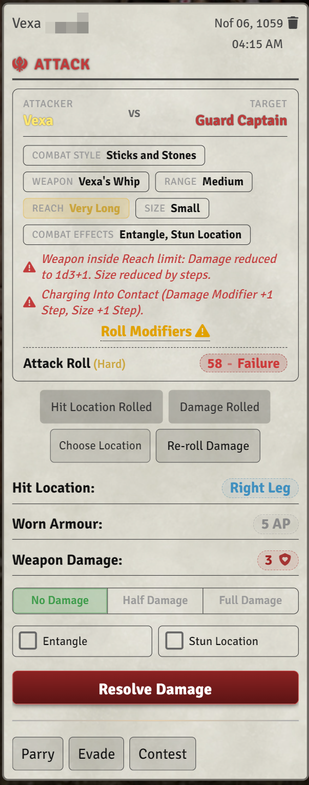

## Parry And Evade

Attack chat cards expose Parry and Evade controls to the defender. These dialogs account for the original attack result and pass the attacker's relevant weapon type, combat effects, combat style traits, weapon size, weapon reach, and current range into the opposed result.

Parrying weapons are unavailable if they are broken, pinned, currently impaling another target, held by an entangled arm, or held by a stunned location. The comparison reports the winner and number of Special Effects earned. Both dialogs also offer a Force Roll Result option; a forced roll is clearly marked with an icon on the roll pill and noted in its tooltip.

Options within the Parry Dialog function very similarly to the options within the Attack Dialog.

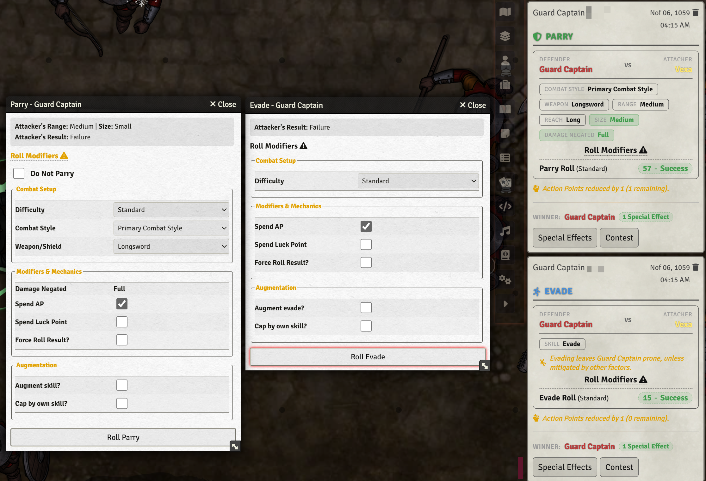

## Take Cover

Select a token and run the **Take Cover** macro. Humanoids receive a body-layout dialog; other creatures receive a location list. Mark every location protected by available cover, or use **Exit Cover** to clear them all.

The macro records protected locations and displays a cover status indicator on the token. The GM must manually determine whether the cover's Armour Points and whether an attack can reach it, using the Rulebook's guidance. The Attack Chat Card will provide status indicators if the rolled hit location is behind cover.

## Ward Location

Select a token and run the **Ward Location** macro. This will open a dialog to allow assigning a held melee weapon to one or more passively guarded locations. The token status indicator tooltip shows the warded locations and warding weapon. The dialog records the declaration; apply the Passive Blocking rules from your chosen Mythras material when resolving a hit. The Attack Chat Card will provide status indicators if the rolled hit location is being passively blocked.

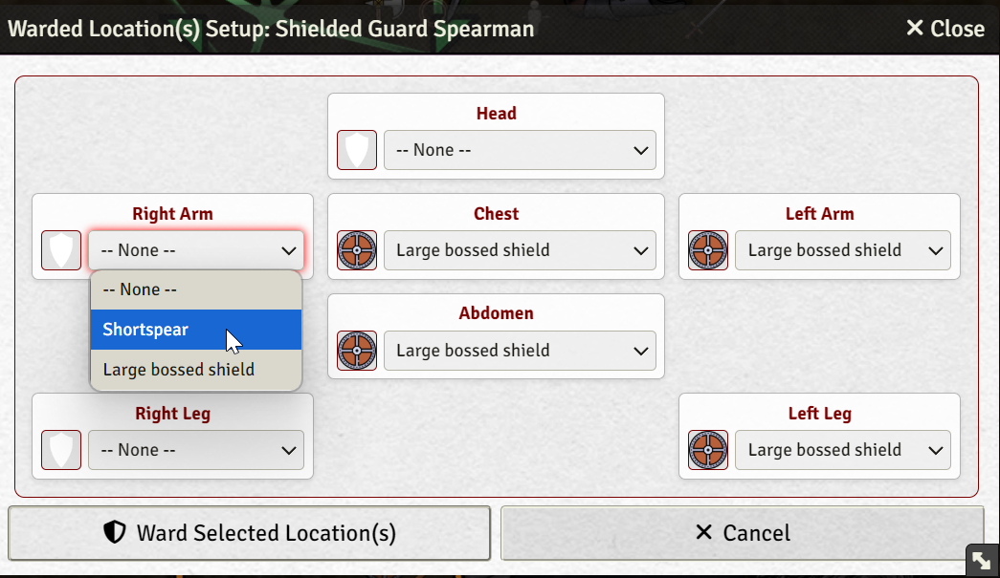

## Set Melee Engagement Range

**Setting required:** **Reach Mechanics**.

Select a token, target one or more opponents, and run the **Set Melee Range** macro. Choose Touch, Short, Medium, Long, or Very Long, or clear the engagement. Range is stored on both actors and appears in a token tooltip.

Attack and Parry use this state to compare weapon Reach. The Attack dialog can establish an engagement automatically, while charging through contact avoids creating a lasting engagement.

Attacking at a range two or more steps shorter than the weapon's reach will reduce the weapon damage to 1d3+1 as per RAW. Attacks cannot be made by a weapon if the current melee range is two or more steps longer than the weapon's reach.

This macro is used to implement the Change Range action and the Open Range and Close Range special effects.

## Reduce AP

A very simple macro that allows reducing the first selected token's AP by one. Also posts a message in the chat notifying the AP reduction and the remaining AP. Sends a warning notification instead if the token does not have enough AP.

## Movement, Fatigue, And Endurance

### Set Movement State

**Setting required:** **Movement State Control in Combat**.

This feature helps implement the movement state rules provided in the _Mythras - Companion_ book.

Select a token, or assign a default character to your user, and run **Set Movement State**. Choose Walk, Run, Sprint, Climb, Swim, or clear the state. It is represented by an Active Effect with its own icon. There is no state added for "Hold Ground". A lack of movement state can be interpreted as holding ground.

During combat, a movement prompt is posted in the chat automatically for each combatant on their first turn of each round. Use the Rulebook's gait, action, and movement restrictions when choosing a state.

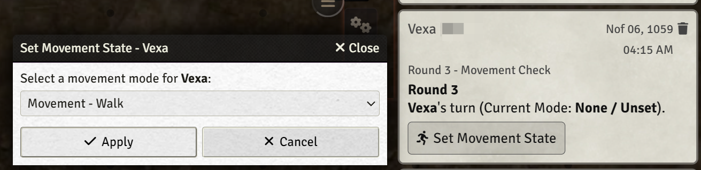

### Bleeding Fatigue Progression During Combat

**Setting required:** **Bleeding Fatigue Progression**.

At the start of a Combat Round, a bleeding combatant (see **Bleed** under Special Effects) advances one step along the fatigue track: Fresh, Winded, Tired, Wearied, Exhausted, Debilitated, Incapacitated, Semi-conscious, Comatose, and Dead. A chat message is posted each time the fatigue progresses due to bleeding. The bleeding status must be cleared using **Clean Up Combat Flags**. It does not progress outside of combat, but the status indicator will remain until cleared.

### Endurance Prompts During Combat

**Setting required:** **Endurance Roll Prompts in Combat**.

The module tracks completed rounds and uses Constitution to determine when the current combatant receives an Endurance prompt as per RAW. The chat button rolls the actor's Endurance skill and reports the result. Fatigue is not changed automatically, however. This simply provides a useful automated reminder to make these rolls.

### Fatigue Indicator

Any fatigue state other than Fresh displays a status indicator on the token. Hovering on it shows the current fatigue level. It updates whenever fatigue changes, including changes caused by Bleeding progression.

### Fatigue Change Announcements

Whenever a character's fatigue level is changed directly (e.g. the GM editing the character sheet) rather than through Bleeding Fatigue Progression, the module posts a chat message noting the change and how long it would take the character to recover back to Fresh. This message is skipped when the change was caused by Bleeding progression, since that feature posts its own message.

### Wounds

Hit-location HP automatically produces Minor, Serious, or Major Wound indicators on the token. They can be hovered on for additional detailed information regarding the wound's severity and location.

### Serious/Major Wounds Prompts

Whenever a hit location's damage newly crosses into the Serious Wound (0 HP or below) or Major Wound (negative HP equal to or beyond its maximum) threshold, the module automatically posts a chat message describing the wound's effects (Limbs and Torso/Head hit locations have distinct prompt descriptions as per the rulebook) along with a **Roll Endurance** button. 

For the purposes of this prompt, hit location strings with the words limb, arm, leg, tail, fin, or wing are treated as limbs, while head, chest, abdomen, torso, thorax, length, body, or quarters are treated as torso. 

Clicking the button opens the same skill roll dialog as clicking Endurance on the character sheet, defaulted to that skill.

A Serious Wound (only) also offers a **Stun Location** button, which - after a confirmation prompt - applies the same Stun Location status and token icon/tooltip as the Stun Location special effect (see Stun Location under Special Effects), attributed to whoever last damaged that location. The only difference is duration: this one has no turn counter and instead clears itself automatically (with its own chat notification) once the location heals back to a Minor Wound, without disturbing the turn-based countdown of any other Stun Location in effect. **Clean Up Combat Flags**' Stunned Locations option clears this variant too.

## Other Token Status Indicators

Impale, Entangle, Stun, Bleed, Disable Attack (e.g. Overextend opponent, Press Advantage, Pin Down, etc.), Fatigue, Cover, Ward, and Engagement each have dedicated indicators. Their tooltips display affected locations, sources, remaining duration, relevant equipment, or opponents as appropriate.

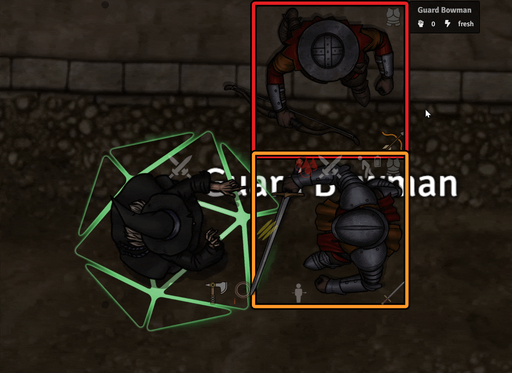

## Special Effects

### Special Effects Selector

When an opposed result awards Special Effects, clicking the Special Effects button on the Parry/Evade chat card opens a selector containing offensive or defensive effects. It automatically filters for melee, ranged, or unarmed use; criticals; opponent fumbles; and weapon or Combat Effects.

This selector is mainly meant to be used as a convenient catalog to browse relevant special effects for an attack/parry/evade sequence. It does not provide any automation currently. For automatic various Special Effects, see below.

The **Re-roll Damage** effect is explicitly homebrew and only appears when **AngryGorilla's Homebrew Rules and Content** is enabled.

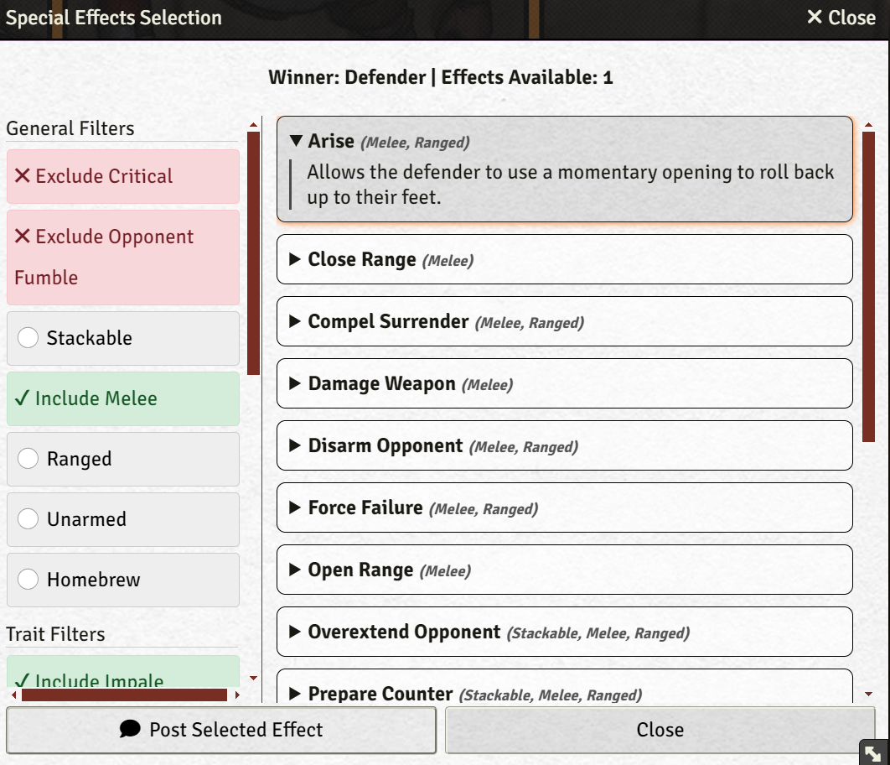

### Impale And Unimpale

If an attacking weapon has the Impale combat effect, a checkbox will appear on the Attack chat card. Checking it on will automatically impale the attacking weapon into the targeted hit location when resolving damage if the damage overcomes armour and reduces hit points. 

The impale status is indicated via a status indicator on the token. If the impaling weapon is a melee weapon, it cannot be used to make further attacks or parries until the Impale macro is used to unimpale it. Running the Impale macro to unimpale a weapon will post a prompt in the chat to apply half damage. If the weapon has the Barbed combat effect, it will apply full damage. The Impale macro can also be used to safely remove impaling weapons without dealing damage.

Additionally, the Impale macro can be used to manually impale hit locations as well.

Ranged weapons with the Impale special effect can also impale targets, however the status icon will indicate that the impaling weapon is a "projectile". Ranged weapons can be used even while they're impaling an individual (there is currently no discrimination between thrown weapons and fire weapons, so thrown weapons can still be used even if they're impaling someone). The impaled victim also receives an injected roll modifier based on the largest impaling weapon and the victim's SIZ.

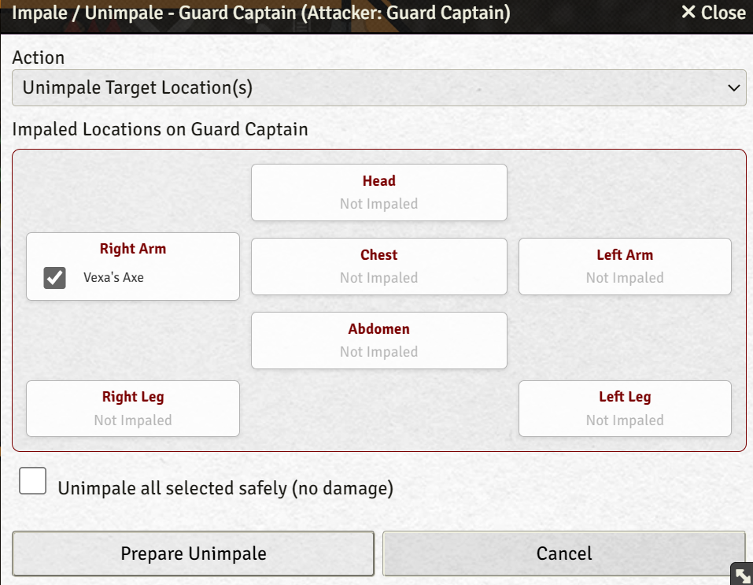

### Entangle And Unentangle

The Attack card can mark the struck location as Entangled. Entangled does not need to overcome armour or deal HP damage to take effect. Entangled arms prevent use of held weapons; entangled legs prevent setting a new melee engagement range; other entangled locations inject a penalty into the Roll Modifiers tooltip.

Select the affected token and run the **Unentangle** macro to clear one or more locations. The dialog shows the source weapon and attacker for each location.

### Stun Location

An eligible Attack can apply **Stun Location** automatically if the damage penetrates armour. The struck location remains incapacitated for a number of turns equal to the (armour-mitigated) damage dealt to the hit location. Head and torso results retain their distinct narrative consequences from the Mythras effect:

- **Head:** The character is knocked senseless and cannot act at all while stunned there. 
- **Chest/Torso/Abdomen:** The character can only defend (Parry/Evade) while stunned there; the **Attack** macro will refuse to open for them until it clears.
- **Arms/Legs:** Only the weapon held in that specific location is disabled for Attack or Parry; the character can otherwise still act normally.

Stun is displayed as a token icon. Its tooltip lists each stunned location, remaining character turns, and the weapon and character responsible.

The turn counter only counts the **stunned character's own turns** - it decrements by exactly 1 each time combat advances to that character's turn (not once per every combatant's turn in the encounter). When a location's counter reaches zero, the stun clears automatically.

### Bleed

An eligible Attack can automatically apply **Bleed** whenever damage actually penetrates armour (armour-mitigated HP damage greater than 0). Bleed must be cleared via **Clean Up Combat Flags**.

Bleed is displayed as a token icon. Its tooltip shows how many rounds (while in active combat) the character has been bleeding, and the weapon and character responsible. Re-applying Bleed (e.g. a fresh wound) resets the round counter to the newest source.

While the **Bleeding Fatigue Progression** setting is enabled, a bleeding character automatically degrades one fatigue step at the start of each Combat Round (see Bleeding Fatigue Progression section).

### Sunder

Select **Sunder** on an eligible Attack card to automatically apply damage to armour. Damage reduces worn armour first based on RAW, then natural armour; any remaining damage carries into the hit location. The final message itemizes each reduction. If the **Original Condition** and **Armour Overlay Icons** module settings are enabled, you can see the damaged status of armour by hovering over the corresponding token icon. 

### Damage Weapon

Target the weapon's owner and run the **Damage Weapon** macro. Choose an equipped weapon and enter the damage amount. The weapon's Armour Points resist damage; surplus reduces the weapon's Hit Points, and a weapon at 0 HP is marked broken and automatically unavailable to be used for attacks and parries.

### Pin Weapon

Select your token, target a token, and run the **Pin Weapon** macro. Choose **Pin a Weapon** to make one of the target's equipped weapons unusable, or **Unpin Weapon(s)** to select one or more of the target's currently pinned weapons and free them. Resolving the opposed action needed to pin or free a weapon remains a table decision; this macro is simply used to implement the result.

### Disable Attack (Press Advantage, Pin Down, Overextend Opponent, Reeling from Serious Wound)

Select your token, target a token, and run the **Disable Attack** macro. Choose which Special Effect is being applied - **Press Advantage**, **Pin Down**, **Overextend Opponent**, or **Reeling from Serious Wound** (for manually disabling attacks per the rulebook's Serious Wound stun-from-pain effect, independent of the automated Stun Location button described below) - and how many of the target's turns it lasts (defaults to 1). The chat message names both the character causing the effect and the character affected, worded for the chosen effect.

The target displays a **Cannot Attack** status icon on the token. Its tooltip names the specific effect, how many of the victim's turns remain, and who caused the effect. As with Stun Location, the counter only decrements on the affected character's own turns and clears automatically at zero. While affected, the **Attack** macro refuses to open for that character, just like a torso or head Stun Location.

# Armour, Equipment, and Items

## Item Statistics

**Settings required:** **Fitting**, **Quality Tracking**, and/or **Original Condition** (independent toggles).

Supported equipment sheets gain custom fields depending on which of these settings are enabled.

### Quality Tracking

Adds a current Quality field to armour, equipment, and weapon sheets. Enabling **AngryGorilla's Homebrew Rules and Content** alongside it also unlocks the non-standard **Exemplary** quality tier.

### Original Condition

Adds original AP/HP fields to armour and weapon sheets. When present, the module compares current condition against these to show damaged and broken badges in token equipment tooltips. If **Quality Tracking** is also enabled, original Value and Quality fields are added alongside them for additional bookkeeping. Note that the values for Original Condition must be set up manually for every item.

### Fitting

Adds SIZ and Frame fields to armour, clothing, and trinkets, plus a Body Part field for armour. These are purely informational text fields and don't have any automated impact.

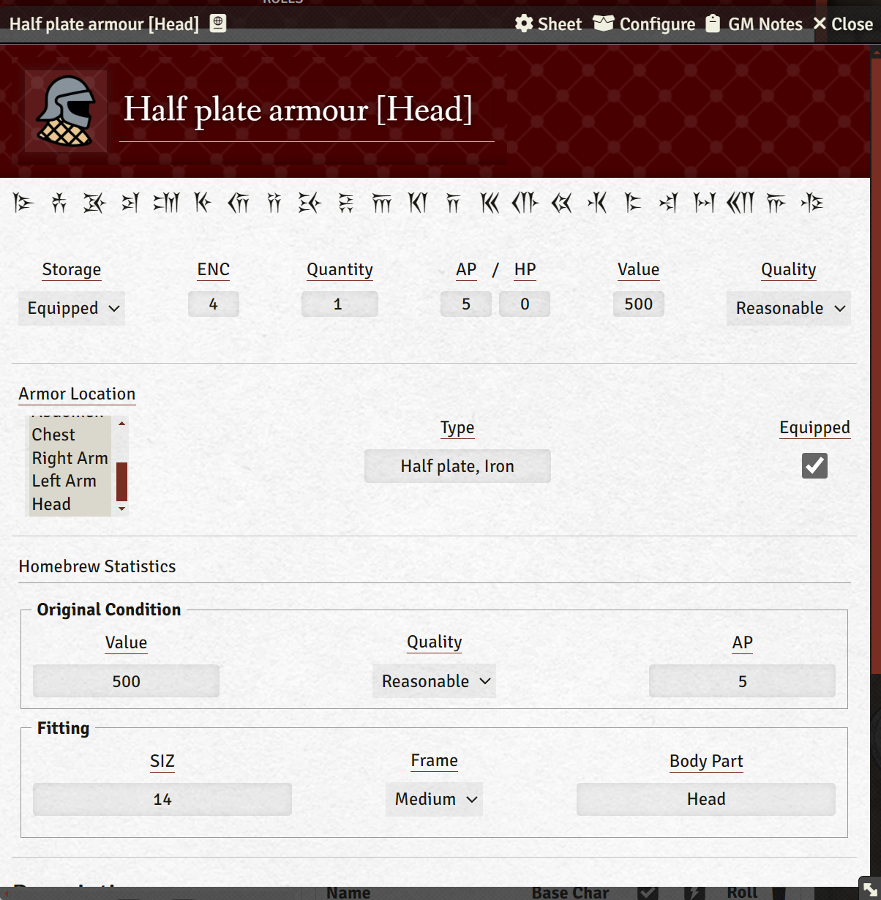

## Equipped Armour Icons on Token

**Setting required:** **Armour Overlay Icons**.

Tokens with equipped armour receive a hoverable indicator. Its tooltip groups armour by hit location and shows damaged/broken condition badges when **Original Condition** is enabled and the item's original AP is recorded.

## Ctrl+Hover - Character Status / Equipped Items Tooltip

**Setting required:** **Show Character Status and Equipped Items on Token Hover**.

Hold Ctrl while hovering a token to open a two-tab tooltip. The **Status** tab lists every hit location with its current/max HP and every tracked status at a glance - wounds, impale, stun, entangle, ward, cover, held weapons, and equipped armour, including damaged/broken condition icons. The **Equipped Items** tab shows the token's Equipped inventory. It does not show items placed inside a storage item. It also does not show storage items that are not "Carried". The equipped item filters are broken down to allow separately filtering for Clothing and Trinkets.

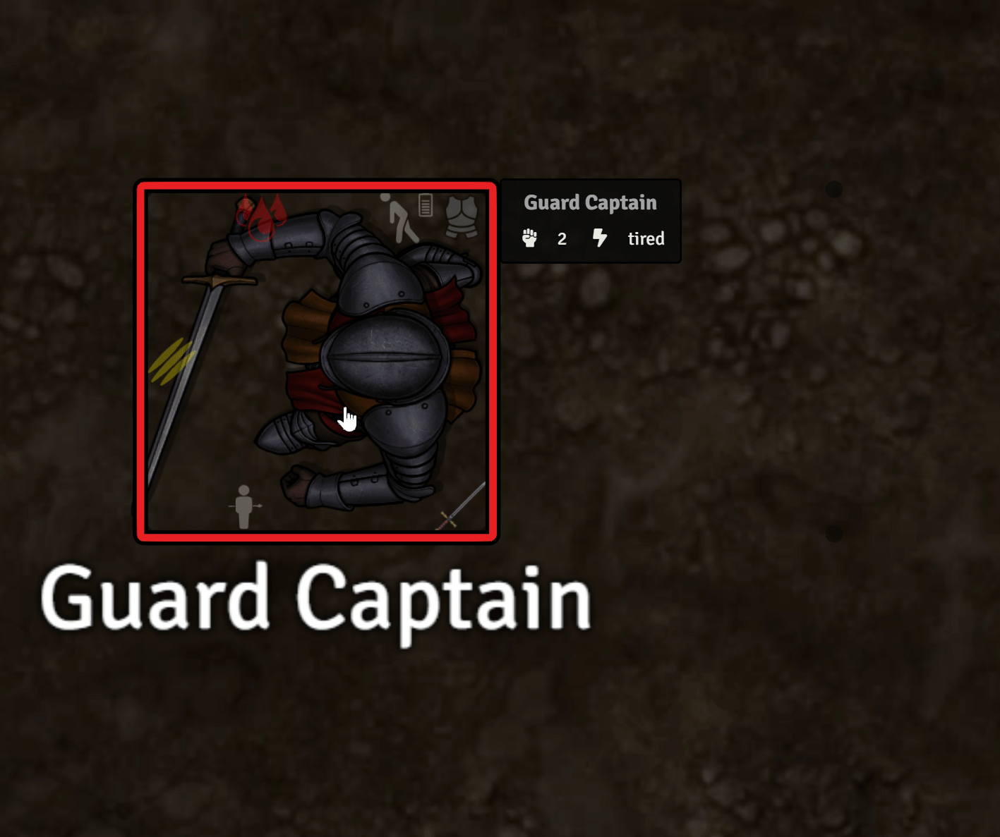

## Add Armour

Select one or more NPC tokens and run **Add Armour**. Choose a complete armour type or a different type for each standard humanoid hit location. Existing armour on a location is left in place.

This utility expects a world Item compendium with collection ID `world.armour`. Complete sets use configured document IDs; custom sets look for pieces named with the expected armour type and location suffix, such as `Padded Armour [Head]` or `Mail Armour [R.Arm]` (yes, it expects the 'armour' spelling - sorry, Americans!). Player-owned actors are skipped, so this is intended as a GM preparation tool.

# Character And Campaign Utilities

## Restore Action Points

Select one or more tokens and run **Restore AP of Selected Tokens**. Each actor's Action Points are restored to its calculated maximum.

## Restore Luck Points

Run **Restore Luck Points of All Player Characters** to restore each non-GM user's assigned character to maximum Luck Points. Users without an assigned character are reported and skipped. This is best run by the GM.

## Upgrade Skill

Select a token and run **Upgrade Skill**, then choose a Standard, Professional, Combat Style, or Magic skill.

- With **Custom Change** enabled, enter a direct training increase and optional reason.
- Otherwise, the macro spends one Experience Roll and rolls `1d100 + INT` against the skill value.
- A successful improvement roll adds `1d4 + 1` training; a failed roll adds 1 training.

The result and remaining Experience Rolls are posted to chat.

## Manage Currency

Select a token and run **Manage Currency**. Enter an amount for each currency item, choose whether it is paid or received, and optionally record a reason. The complete payment is validated before any balance changes, then an old/changed/new summary is posted to chat. This dialog only displays currently items that are present on the selected actor (even if the quantity is zero - or negative, for whatever reason).

## Randomize Build

Select one or more NPC tokens and run **Randomize Build**. Choose levels for characteristics and Physical, Utility, Deception, Social, and Combat skills. The macro rolls new values, restores AP, and refreshes hit-location HP.

Player-owned actors are skipped. This is a campaign utility, not a Rulebook character-creation method; review its result bands for your creatures and campaign power level.

## Contested Roll (1v1) - (Deprecated)

Select one token, target another, and run **Contested Roll (1v1)** to compare two selected skills with independent difficulty grades and flat augments. This macro is retained for existing workflows but marked **deprecated** because the current Mythras system rolls provide native opposed/contested roll support.

# Rules And Homebrew At A Glance

## Rulebook-Oriented Automation

The module assists with Action Points, Luck Points, attacks, hit locations, armour, Parry, Evade, opposed outcomes, fatigue, Bleed, weapon reach, cover, and several combat Special Effects. It reduces bookkeeping while leaving eligibility and interpretation up to the GM.

## Companion And Expanded Combat Options

The Special Effects catalogue includes expanded some combat options intended for tables using broader Mythras material, including the *Mythras Companion*. Supplements and campaign assumptions vary, so the module filters by roll state and traits but does not certify that every displayed effect is valid in every encounter.

## Explicit Homebrew

Enable **AngryGorilla's Homebrew Rules and Content** only if the table wants the Re-roll Damage Special Effect or the non-standard **Exemplary** quality tier.

# Troubleshooting

## A macro says its function is not loaded

Confirm the module is enabled, then reload the world. Imported macros only launch functions supplied by the active module. Also ensure that you are not using an outdated version of the macro. You may need to re-import the macro from the module's macro compendium.

## A ranged weapon says Not loaded

Run **Reload** and complete the required Load actions. Ranged weapons with a Load value of 0 do not require this step.

## A weapon does not appear in Attack or Parry

Run **Equip Weapon** and assign it to a holding location. Also check whether it is broken, pinned, lodged in another target, held by an entangled or stunned location, outside usable Reach, or not fully loaded.

## Add Armour cannot find armour

Confirm that the world has an Item compendium with collection ID `world.armour`, and custom pieces follow the naming convention shown in the dialog.

## Movement controls are unavailable

Enable **Movement State Control in Combat** and reload the world so its combat hooks and dialog helpers initialize.

## An indicator is stale

Update the associated actor/item once or refresh the scene. If old combat flags are no longer valid, run **Clean Up Combat Flags**.

## A tooltip appears in the wrong place

Use a supported browser zoom level. Status indicator tooltips intentionally remain hidden while their canvas position is covered by a Foundry window.

# Module Limitations

This module's features are fairly thorough and deep, but they still have several notable limitations.
- No automation or consideration has been added for magic in this module. I always run magic-sparse campaigns. As such, I have no plans to work on features that automate magic usage.
- The Attack sequence currently has no consideration for attacks hitting multiple opponents or multiple hit locations. Each attack, in such cases, must be made separately. However, the Attack, Parry, and Evade dialogs do provide a "Forced Roll Result" option if all of these individual attacks need to be dictated by a single dice roll. In such cases, a 1d100 can be rolled by the user first and then the Attacks can be made with a Forced Roll Result value matching the result of that first d100.
- The Attack/Parry/Evade currently does not have built-in automated support for accounting for opposed roll skill deduction from skills higher than 100%. However, once again, the Forced Roll Result and Custom Augment fields can be used in these features to simulate this mechanic.
- While I have tried to gate several of the optional features behind module settings, there may still be undesired features that specific GMs may not want on their tables. The detailed tooltips provided by this module may additionally be a hindrance for some GMs, as they may convey information the GM does not want their players to see. Unfortunately, individual settings for such information is out of scope for my module.
- Some individuals may find the overlay icons on the token to be crowding and undesirable. Unfortunately, with the informative tooltips I had envisioned, using the FVTT Native Active Effects simply did not suit my needs. As such, I had to find an alternative solution, and this was the best I could do.
- As there is no siege weapon or firearms item type in the Foundry VTT Mythras system, these weapons can be designated by adding "Siege" or "Firearm" combat effects to the relevant weapons instead. This is only relevant for the automatic filtering in the Special Effects selection dialog.
- The quality of the weapon and armour overlay icons will depend heavily on the images you use for your items. Visual parity with your own icons is not guaranteed with the icons this module provides.

# Credits

- **Module Author:** AngryGorilla / AngriestGorilla (assisted by several Generative AI models - see Generative AI Usage under Developer Commentary)
- **System:** [Mythras for Foundry VTT](https://gitlab.com/kp-systems/mythras) developed chiefly by [Greshbolt](https://gitlab.com/Greshbolt), but supported by several other community developers.
- The Attack workflow was originally inspired by DogBoneZone's all-in-one combat macro, but has since been overhauled almost entirely for this module.
- The tokens, maps, and other visuals in the screenshots use a mix of assets from Forgotten Adventures, Flaticon, and custom creations.

Mythras and related product names belong to The Design Mechanism and their respectful right-holders. This is an independent community module.
 
# Developer Commentary

## Recommendations of Use

I will be using this section to keep track of recommendations and tips and tricks on how to use this module effectively.

- For a smooth turn sequence where the Action Points are managed as efficiently as possible, I recommend turning on the Reduce AP option provided by the Mythras system. Then, simply go through the attack sequence using this module's macros with the default Spend AP selections. Parries and Evades have Spend AP turned on by default to automatically spend AP with those reactive actions, while the AP expense of Attacks and other Proactive actions can be automatically resolved by proceeding to the next turn in the cycle. Spending a Luck Point or selecting Do Not Parry in the Parry dialog automatically unchecks the Spend AP option as well.

## Generative AI Usage

Please be informed that this project has been developed with assistance from various Generative AI models. Users with principles against Generative AI usage may prefer to avoid this module.

That said, software development is my day job - my bread and butter. I have endeavoured to use AI tools responsibly and with accountability. All features within this project are conceptualized and designed by me with care, using my understanding of the Mythras rules. AI was mostly used for the menial labour of writing out the logic I was explicitly describing. Additionally, I have tested every feature quite thoroughly. That's not to say the module is guaranteed to be bug-free, but, I have made great effort to test as many edge cases as I could. If you discover any uncaught bugs, I encourage you to report them through the GitHub Issues feature.

## End Goal

I have tailored this module to suit my own table's playstyle and my preferences as a GM. As such, there may be several features added and decisions made for this module that may not be favourable for other GMs and tables. I have tried to make the module with as much flexibility as I could provide within the interest of time, but, it may not scratch everyone's unique itches. You are welcome to make feature requests on the repository, but, be warned, I am hyper-discriminative when working on features, so nothing personal if your feature requests get ignored. For any developer-minded members of the Mythras community, you are welcome to fork my repository to make your own flavour of these features. The best I can hope for is to be included in the credits, but I don't plan to chase anyone down either way.